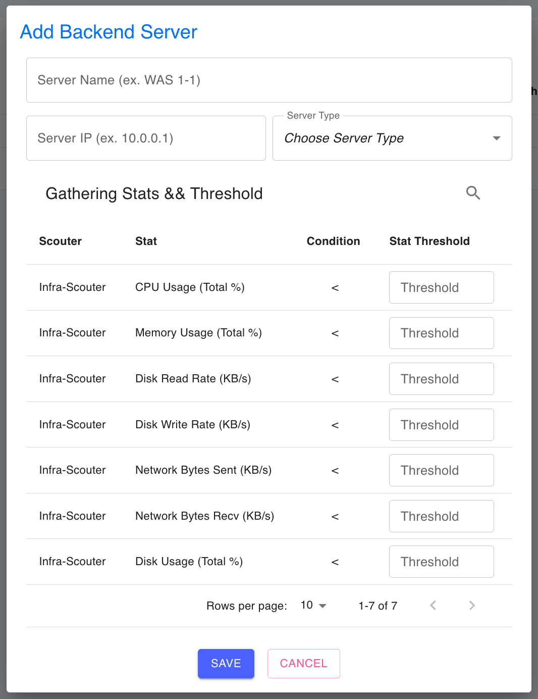

# Infra Scouter 설치 가이드

## 설치 방법

### 1. 서버 등록

IQ² 콘솔에서 Infra Scouter 를 설치할 서버를 등록합니다.



1. 서버 이름과 서버 IP를 입력합니다.
2. 서버의 타입을 선택하고 사용할 임계값을 입력합니다.
3. SAVE 버튼을 클릭합니다.

### 2. 설정 파일 수정

`config.yaml` 의 값을 수정하고 `infra-scouter` 빌드 파일이 위치하는 디렉터리에 복사합니다.

#### 설정 파일 항목
- scouter
    - serverName: Scouter를 실행하는 서버의 이름 **(콘솔에 등록한 정보와 일치해야 함)**
    - serverIP: Scouter를 실행하는 서버의 IP **(콘솔에 등록한 정보와 일치해야 함)**
- masterAPI
    - url: Master API 요청 주소
- metrics:
    - collectionInterval: 수집 주기 (단위: 초)
    - names: 수집하려는 메트릭 이름
    - diskName: 수집하려는 디스크 이름
    - networkInterfaceName: 수집하려는 네트워크 인터페이스 이름
- logging
    - level: 로깅 레벨
    - path: 로그 파일 절대 경로
    - maxSize: 로그 파일 최대 사이즈 (단위: MB)
    - maxAge: 로그 파일 저장 기간 (단위: 일)

### 3. Infra Scouter 실행

```sh
# 실행
./infra-scouter

# 백그라운드 실행
nohup ./infra-scouter > /dev/null 2>&1 &
```
